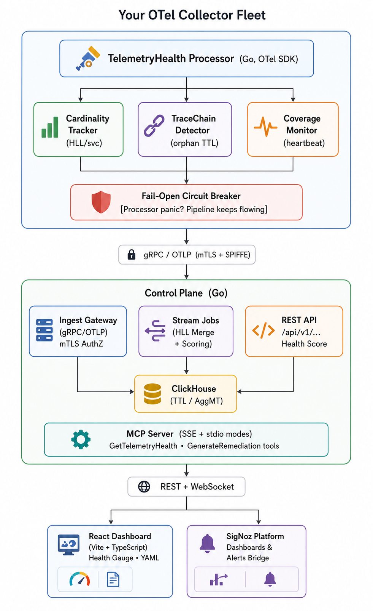

<div align="center">


# TelemetryHealth

### *Observe Your Observability — Before Your Users Notice*

**A production-grade OpenTelemetry Collector processor + AI-powered control plane that continuously monitors, scores, and auto-heals your telemetry pipeline in real time.**

[](https://golang.org)
[](https://react.dev)
[](https://opentelemetry.io)
[](https://signoz.io)
[](LICENSE)
[](https://wemakedevs.org/hackathons/signoz)

> **Built for the SigNoz Agents of Observability Hackathon · Track 02: Signals & Dashboards · Jul 20–26, 2026**

</div>

---

<div align="center">

<h2 id="live-demo--video-walkthrough"> Live Demo & Video Walkthrough</h2>

<video
  src="https://github.com/user-attachments/assets/af67f067-0f4d-4c7a-8902-a19d9eb0b1b6"
  controls
  preload="metadata"
  width="680"
  height="383"
  style="max-width: 100%; border-radius: 12px; display: block; margin: 0 auto;">
</video>

</div>

---

<h2 id="table-of-contents"> Table of Contents</h2>

- [Live Demo & Video Walkthrough](#live-demo--video-walkthrough)

- [The Problem](#the-problem)
- [Solution Overview](#solution-overview)
- [Architecture](#architecture)
- [Key Features](#key-features)
- [SigNoz MCP Server Integration](#signoz-mcp-server-integration)
- [SigNoz Deep Integration](#signoz-deep-integration)
- [Dashboard Views](#dashboard-views)
- [Repository Structure](#repository-structure)
- [Getting Started](#getting-started)
- [API Reference](#api-reference)
- [Security Model](#security-model)
- [Test Coverage](#test-coverage)
- [Custom OTel Metrics Emitted](#custom-otel-metrics-emitted)
- [AI Agent Observability](#ai-agent-observability)
- [CI/CD](#cicd)
- [Roadmap](#roadmap)
- [Tech Stack](#tech-stack)
- [License](#license)

---

<h2 id="the-problem"> The Problem</h2>

You spend weeks setting up OpenTelemetry. You deploy SigNoz. You breathe easy.

Then, three months later:
- Your SigNoz bill **quadrupled** — a developer shipped `user_id` as a metric label, creating **1.2M unique cardinality values**
- Half your traces are **orphaned** — broken distributed chains show gaps across microservices
- A critical service **silently stopped emitting** telemetry two weeks ago — nobody noticed
- Your AI agent workflows are **burning through LLM tokens** at 10x the expected rate, with no visibility into why

**The painful irony: your observability system is unobserved.**

---

<h2 id="solution-overview"> Solution Overview</h2>

TelemetryHealth is **meta-observability** — it observes your observability.

It sits *inside* your OTel Collector pipeline as a custom processor, and continuously monitors the health of your telemetry signals in real time. When it detects an anomaly, a Go control plane scores the issue, a root cause engine diagnoses it, and a remediation generator produces validated OTel YAML config patches — all exposed via a React dashboard and a **SigNoz MCP Server** so AI agents can detect *and fix* pipeline issues autonomously.

**Three-word summary: Detect → Score → Heal.**

---

<h2 id="architecture"> Architecture</h2>

<div align="center">



</div>

---

<h2 id="key-features"> Key Features</h2>

| # | Feature | What It Does | Implementation |
|---|---------|-------------|----------------|
| 1 | **Cardinality Explosion Detection** | Flags attributes with label cardinality spiking past thresholds (e.g. `user_id`, `session_id`) | Per-service HyperLogLog sketches in `processor/cardinality/tracker.go` |
| 2 | **Broken Trace Chain Detection** | Identifies orphaned spans — spans whose `parent_span_id` references a span that never arrived | Bounded out-of-order correlation in `processor/tracechain/orphan_detector.go` |
| 3 | **Coverage Gap Detection** | Catches services that silently stop emitting telemetry (zero signals in a configurable window) | Heartbeat tracking per service in control plane |
| 4 | **AI Agent Health Monitoring** | Tracks token burn rates, hallucination risk, broken decision chains, and tool-call failures in LLM agents | OTel GenAI semantic convention attribute inspection (`gen_ai.usage.*`, `llm.*`) |
| 5 | **Composite Health Score** | Weighted 0–100 score combining all signal sources, configurable per tenant | Aggregate stream job in control plane |
| 6 | **Auto-Remediation** | Generates validated OTel YAML config patches (template-driven) and validates against an OTel component allowlist | `remediation/generator.go` + `remediation/validator.go` with embedded `.yaml.tmpl` templates |
| 7 | **Fail-Open Circuit Breaker** | Processor panic or error? Circuit breaker trips — telemetry flows through unprocessed, **never dropped** | `processor/failopen/circuit_breaker.go` (93.9% test coverage) |

---

<h2 id="signoz-mcp-server-integration"> SigNoz MCP Server Integration</h2>

TelemetryHealth implements a **Model Context Protocol (MCP)** server, natively integrating with SigNoz's AI agent workflows.

| MCP Tool | Description |
|---|---|
| `get_telemetry_health` | Returns real-time composite health score, cardinality metrics, orphan span rates, and coverage gaps for any tenant |
| `generate_remediation` | Generates a verified, structurally-validated OTel YAML config patch to fix a detected issue |

**Protocol:** Full JSON-RPC 2.0 implementation (`initialize`, `ping`, `tools/list`, `tools/call`) in [`control-plane/internal/mcp/server.go`](./control-plane/internal/mcp/server.go).

```bash
# SSE mode (default, port 8081)
go run ./cmd/mcp-server

# stdio mode (for direct agent integration)
go run ./cmd/mcp-server --stdio
```

This turns TelemetryHealth into an **Autonomous Telemetry Intelligence Platform** — SigNoz AI agents can detect *and fix* pipeline health issues without human intervention.

---

<h2 id="signoz-deep-integration"> SigNoz Deep Integration</h2>

TelemetryHealth uses SigNoz as both a **data sink** and a **visualization + alerting platform**:

- **Custom OTLP Metrics** — The processor emits `telemetryhealth_*` metrics (health scores, cardinality counts, orphan rates, token burn rates, hallucination risk) into SigNoz via the OTLP exporter
- **Prometheus Endpoint** — Control plane exposes `/metrics` for scraping with Prometheus-format counters, gauges, and histograms
- **Alert Rules** — Pre-configured SigNoz alert YAML definitions in [`alerts/`](./alerts/) — fires when health score drops below threshold or cardinality exceeds budget
- **Alertmanager Bridge** — `internal/alerting/` integrates with SigNoz Alertmanager with 15-minute cooldown deduplication to prevent alert storms
- **Foundry Deployment** — `casting.yaml` enables one-command reproducible deployment via SigNoz Foundry
- **SigNoz Query Client** — `internal/storage/signoz/` bridges live SigNoz data into the dashboard for real-time connectivity status

---

<h2 id="dashboard-views"> Dashboard Views</h2>

The React dashboard (Vite + TypeScript + React 19) provides 8 dedicated views:

| View | Description |
|---|---|
| **Overview** | Animated health gauge, KPI metric cards (cardinality, orphans, coverage, token burn), issue list, interactive telemetry terminal |
| **Cardinality** | Cardinality trend visualization per service/attribute |
| **Trace Chains** | Orphaned span statistics and broken trace chain analysis |
| **Coverage** | Service coverage status with active/silent state and last-seen timestamps |
| **Remediation** | Auto-generated OTel YAML patches with validation status, one-click copy, and GitHub PR button |
| **AI Agents** | LLM agent trace inspection: behavior graphs (ReactFlow), decision reconstruction, root cause analysis, hallucination risk |
| **Topology Twin** | Service topology digital twin visualization |
| **SigNoz Integration** | SigNoz connectivity status, configuration, and live dashboard links |

---

<h2 id="repository-structure"> Repository Structure</h2>

```
Telemetry_Health_SIGNOZ/
├── processor/                        # OTel Collector Processor (Go module)
│   ├── factory.go                    #   Component factory & registration
│   ├── config.go                     #   Processor config schema
│   ├── base_consumer.go              #   Shared signal consumer base (health signal queue)
│   ├── traces_consumer.go            #   Traces hook: AI agent detection, cardinality filter, gRPC export
│   ├── metrics_consumer.go           #   Metrics hook
│   ├── logs_consumer.go              #   Logs hook
│   ├── metrics.go                    #   OTel self-instrumentation (health_score, token_burn, trace_errors)
│   ├── cardinality/tracker.go        #   HyperLogLog cardinality tracker (93.3% coverage)
│   ├── tracechain/                   #   Orphan span detector + span buffer
│   └── failopen/circuit_breaker.go   #   Fail-open circuit breaker (93.9% coverage)
│
├── control-plane/                    # Control Plane (Go module)
│   ├── cmd/
│   │   ├── api-server/               #   REST API entrypoint (port 8080)
│   │   ├── mcp-server/               #   MCP server entrypoint (port 8081, SSE + stdio)
│   │   ├── ingest-gateway/           #   gRPC OTLP receiver (port 4317)
│   │   ├── worker/                   #   Kafka consumer / stream job workers
│   │   ├── simulator/                #   Anomaly injection simulator
│   │   ├── seeder/                   #   Data seeder for demos
│   │   ├── init-db/                  #   ClickHouse schema initializer
│   │   ├── mock-server/              #   Standalone mock data server
│   │   └── e2e-test/                 #   End-to-end test runner
│   └── internal/
│       ├── api/rest/                 #   REST API handlers + routes (chi router)
│       ├── mcp/                      #   MCP server (JSON-RPC 2.0, tools/list, tools/call)
│       ├── engine/                   #   Behavior graph, decision graph, root cause graph engines
│       ├── behavior/                 #   Behavior reconstruction from raw spans
│       ├── decision/                 #   Decision reconstruction from behavior graphs
│       ├── rootcause/                #   Root cause intelligence engine
│       ├── remediation/              #   YAML patch generator + OTel allowlist validator + templates
│       ├── simulator/                #   Anomaly injection scenarios (cardinality, dropped spans, agentic)
│       ├── alerting/                 #   SigNoz Alertmanager bridge (15-min cooldown)
│       ├── authz/                    #   mTLS / SPIFFE zero-trust verification (100% coverage)
│       ├── ingest/                   #   gRPC server impl (Traces, Metrics, Logs)
│       ├── streaming/                #   HLL merge + scoring stream jobs
│       ├── storage/                  #   Repository interface
│       │   ├── clickhouse/           #   ClickHouse DDL schema, query layer, health/replay repos
│       │   ├── mock/                 #   In-memory mock repository (graceful fallback)
│       │   └── signoz/               #   SigNoz query client
│       ├── kafka/                    #   Kafka producer/consumer
│       └── telemetry/                #   Prometheus metrics + OTel SDK self-instrumentation
│
├── dashboard/                        # Frontend (React 19 + Vite + TypeScript)
│   └── src/
│       ├── components/
│       │   ├── views/                #   8 dashboard views (Overview, Cardinality, TraceChains, etc.)
│       │   ├── HealthGauge.tsx       #   Animated circular SVG health gauge
│       │   ├── MetricCard.tsx        #   KPI metric cards with delta indicators
│       │   └── SigNozComponents.tsx  #   SigNoz status badge, alert banner
│       ├── App.tsx                   #   Root: multi-tenant selector, API fetch, state management
│       └── main.tsx                  #   Entry point with error boundary
│
├── sdk-clients/
│   └── ai-agent-demo/               #   Sample LLM agent with OTel GenAI instrumentation (Python)
│
├── alerts/                           #   SigNoz alert rule definitions (YAML)
├── test/load/                        #   Load testing suite
├── .github/workflows/                #   CI: commit lint, Go test, security scan, build verify
├── casting.yaml                      #   SigNoz Foundry deployment manifest
├── docker-compose.yml                #   Full stack: ClickHouse + Redpanda + Backend + Frontend
├── docker-compose.db.yaml            #   Lightweight: ClickHouse + Redpanda only
└── LICENSE                           #   MIT License
```

---

<h2 id="getting-started"> Getting Started</h2>

### Prerequisites

| Tool | Version | Install |
|---|---|---|
| Go | ≥ 1.22 | [go.dev](https://go.dev/dl/) |
| Node.js | ≥ 20 | [nodejs.org](https://nodejs.org) |
| Docker | any (optional) | [docker.com](https://docker.com) |
| Git | any | [git-scm.com](https://git-scm.com) |

### Quick Start (Without Docker)

```bash
# 1. Clone
git clone https://github.com/CyberCodezilla/Telemetry_Health_SIGNOZ.git
cd Telemetry_Health_SIGNOZ

# 2. Start the Backend API (Terminal 1)
cd control-plane
go mod tidy
go run ./cmd/api-server
# → REST API on http://localhost:8080
# → Prometheus metrics on http://localhost:8080/metrics
# → Swagger docs on http://localhost:8080/swagger/

# 3. Start the MCP Server (Terminal 2)
cd control-plane
go run ./cmd/mcp-server
# → MCP SSE server on http://localhost:8081

# 4. Start the Dashboard (Terminal 3)
cd dashboard
npm install
npm run dev
# → Dashboard on http://localhost:5173
```

> **Note:** The backend gracefully falls back to an in-memory mock data store when ClickHouse is unavailable — all dashboard views work out of the box for demos.

### With Docker (Full Stack)

```bash
docker compose up -d
# Starts ClickHouse, Redpanda (Kafka), Backend, and Frontend
```

### Run Tests

```bash
# Processor tests (cardinality, circuit breaker, tracechain)
cd processor && go test ./... -v -cover

# Control Plane tests (authz, decision, behavior, remediation)
cd control-plane && go test ./... -v
```

---

<h2 id="api-reference"> API Reference</h2>

### Core Endpoints

| Method | Endpoint | Description |
|--------|----------|-------------|
| `GET` | `/api/v1/tenant/{tenant_id}/health` | Composite health score, metrics, auto-remediation |
| `GET` | `/api/v1/tenant/{tenant_id}/issues` | Active health issues for a tenant |
| `GET` | `/api/v1/tenant/{tenant_id}/agents` | AI agent trace data with health scores |
| `GET` | `/api/v1/tenant/{tenant_id}/coverage` | Service coverage status |
| `GET` | `/api/v1/tenant/{tenant_id}/traces/orphans` | Orphaned trace statistics |
| `GET` | `/api/v1/tenant/{tenant_id}/root-cause` | Root cause causal graph for an issue |
| `GET` | `/api/v1/tenant/{tenant_id}/behavior` | Behavior graph for a tenant |
| `POST` | `/api/v1/tenant/{tenant_id}/simulate` | Inject simulated anomalies |
| `GET/PUT` | `/api/v1/tenant/{tenant_id}/config` | Tenant health scoring weights |
| `POST` | `/api/v1/remediation/apply` | Validate and apply a remediation patch |

### Agent Intelligence Endpoints

| Method | Endpoint | Description |
|--------|----------|-------------|
| `GET` | `/api/agents/{agent_id}/traces/{trace_id}/behavior` | Behavior graph (ReactFlow format) |
| `GET` | `/api/agents/{agent_id}/traces/{trace_id}/decisions` | Decision reconstruction graph |
| `GET` | `/api/agents/{agent_id}/traces/{trace_id}/root-cause` | Root cause analysis verdict |

### Interactive Terminal Endpoints

| Method | Endpoint | Description |
|--------|----------|-------------|
| `POST` | `/api/v1/analyze` | Start an analysis job |
| `GET` | `/api/v1/analysis/{job_id}/logs` | Stream analysis logs (SSE) |
| `GET` | `/api/v1/analysis/{job_id}` | Get analysis result |

### Infrastructure

| Method | Endpoint | Description |
|--------|----------|-------------|
| `GET` | `/healthz` | Liveness probe |
| `GET` | `/readyz` | Readiness probe (checks ClickHouse) |
| `GET` | `/metrics` | Prometheus metrics endpoint |
| `GET` | `/swagger/*` | Swagger API documentation |

### Sample Response — `GET /api/v1/tenant/{id}/health`

```json
{
  "healthScore": 84,
  "metrics": {
    "cardinality": { "value": "1.2M", "change": 14.5 },
    "orphans":     { "value": "432",  "change": -5.2 },
    "coverage":    { "value": "14",   "change": 0 }
  },
  "remediation": {
    "issueType": "High Cardinality (user_id on checkout_service)",
    "yaml": "processors:\n  attributes/remediation:\n    actions:\n      - key: user_id\n        action: delete",
    "validated": true
  },
  "tenantId": "00000000-0000-0000-0000-000000000001",
  "version": "v1.1.0"
}
```

---

<h2 id="security-model"> Security Model</h2>

| Layer | Implementation |
|-------|---------------|
| **mTLS Everywhere** | Ingest Gateway requires mutual TLS for all OTLP connections |
| **Zero-Trust Tenant Verification** | gRPC interceptor verifies `x-tenant-id` header against client certificate's SPIFFE URI SAN — tenants cannot spoof each other (`internal/authz/`, **100% test coverage**) |
| **OIDC Auth Middleware** | JWT Bearer token validation with OIDC issuer JWKS verification (production), secure dev fallback (hackathon mode) |
| **Rate Limiting** | Per-IP token bucket rate limiter (20 burst, 100ms refill) |
| **Fail-Open Circuit Breaker** | Processor crash → circuit breaker trips → telemetry flows through unprocessed, **never dropped** (`processor/failopen/`, **93.9% coverage**) |
| **YAML Allowlist Validation** | Generated remediation patches validated against OTel component allowlist — no arbitrary config injection |
| **Input Sanitization** | UUID regex validation on all `tenant_id` parameters (PRD §13.1) |
| **SOC 2 Audit Trail** | All remediation apply events logged with actor, role, source IP, and timestamp to ClickHouse |

---

<h2 id="test-coverage"> Test Coverage</h2>

| Package | Coverage | What's Tested |
|---------|----------|---------------|
| `processor/cardinality` | **93.3%** | HLL accuracy, collision resistance, memory bounds |
| `processor/failopen` | **93.9%** | Circuit breaker open/close/half-open/reset, panic recovery |
| `control-plane/authz` | **100%** | SPIFFE SAN verification, tenant spoofing prevention |
| `control-plane/decision` | **100%** | Decision reconstruction from behavior graphs |
| `control-plane/behavior` | **100%** | Behavior graph reconstruction from raw spans |
| `control-plane/remediation` | **100%** | Template rendering, variable substitution, OTel allowlist validation |

```bash
# Run all tests
cd processor && go test ./... -cover
cd ../control-plane && go test ./...
```

---

<h2 id="custom-otel-metrics-emitted"> Custom OTel Metrics Emitted</h2>

TelemetryHealth emits the following custom metrics into SigNoz:

### Processor-Level (OTLP)
| Metric | Type | Description |
|--------|------|-------------|
| `telemetryhealth_agent_health_score` | Gauge | Composite health score of AI Agent traces (0–1) |
| `telemetryhealth_agent_token_burn_total` | Counter | AI Agent token consumption total |
| `telemetryhealth_agent_trace_error_count` | Counter | AI Agent trace failure trends |

### Control Plane (Prometheus)
| Metric | Type | Description |
|--------|------|-------------|
| `telemetryhealth_pipeline_health_score` | Gauge | Composite pipeline health score per tenant |
| `telemetryhealth_ingested_spans_total` | Counter | Total spans received by ingest gateway |
| `telemetryhealth_api_requests_total` | Counter | HTTP request count by method/path/status |
| `telemetryhealth_api_request_duration_seconds` | Histogram | API latency distribution |
| `telemetryhealth_clickhouse_write_duration_seconds` | Histogram | ClickHouse insert latency |
| `telemetryhealth_kafka_messages_processed_total` | Counter | Kafka messages processed by stream workers |
| `telemetryhealth_agent_hallucination_risk` | Gauge | Hallucination risk (0=Low, 0.5=Medium, 1=High) |
| `telemetryhealth_agent_token_efficiency` | Gauge | Tokens consumed per successful decision step |

---

<h2 id="ai-agent-observability"> AI Agent Observability (Hackathon Theme)</h2>

TelemetryHealth was purpose-built for the **SigNoz Agents of Observability Hackathon**. It provides first-class observability for AI agent workflows instrumented with OpenTelemetry:

### What It Detects
- **Token Cost Explosions** — Agents burning through LLM credits at abnormal rates
- **Broken Decision Chains** — Missing spans in agentic reasoning loops
- **Tool Call Failures** — Silent failures in agent tool execution
- **Hallucination Risk** — High-confidence misalignment between agent intent and outputs
- **Retrieval Collapse** — Retriever returning zero documents, causing context loss

### Three Intelligence Engines
1. **Behavior Graph Engine** — Reconstructs the execution path from raw OTel spans into a visual behavior graph (ReactFlow format)
2. **Decision Reconstruction Engine** — Maps behavior nodes to inferred decision points with alternatives, confidence, and causal edges
3. **Root Cause Intelligence Engine** — Analyzes behavior + decision graphs to identify probable root cause (tool timeout, token limit, retrieval collapse, latency anomaly)

### Sample Instrumented Agent
See [`sdk-clients/ai-agent-demo/`](./sdk-clients/ai-agent-demo/) for a Python LLM agent with full OTel GenAI semantic convention instrumentation.

---

<h2 id="cicd"> CI/CD</h2>

| Workflow | Trigger | What It Does |
|----------|---------|---------------|
| [`ci.yml`](./.github/workflows/ci.yml) | Push/PR to `main` | Commit message lint, Go test (processor + control-plane) |
| [`verify-build.yaml`](./.github/workflows/verify-build.yaml) | Push/PR to `main` | Build verification |
| [`security-scan.yml`](./.github/workflows/security-scan.yml) | Push/PR to `main` | Security vulnerability scanning |

---

<h2 id="roadmap"> Roadmap</h2>

| Milestone | Status | Description |
|---|---|---|
| M1 — Core Detection (Alpha) | Complete | Processor, Circuit Breaker, HLL Cardinality, Orphan Detector |
| M2 — Control Plane (Beta) | Complete | Ingest Gateway, mTLS AuthZ, Stream Jobs, ClickHouse Schema |
| M3 — Remediation & Hardening (GA) | Complete | Remediation Generator + Validator, SigNoz Bridge, Alert Rules |
| M4 — Dashboard | Complete | React UI with 8 views, Health Gauge, Metric Cards, YAML Viewer |
| M5 — AI Agent Intelligence | Complete | Behavior/Decision/Root Cause engines, Agent Traces view |
| M6 — MCP Server | Complete | JSON-RPC 2.0, SSE + stdio modes, SigNoz AI agent integration |

---

<h2 id="tech-stack"> Tech Stack</h2>

| Layer | Technology |
|-------|-----------|
| **OTel Processor** | Go 1.22+, OpenTelemetry Collector SDK, gRPC, Protocol Buffers |
| **Control Plane** | Go, Chi router, ClickHouse, Redpanda (Kafka), Prometheus client |
| **Dashboard** | React 19, TypeScript 6, Vite 8, ReactFlow, Lucide Icons |
| **MCP Server** | Go, JSON-RPC 2.0, SSE, stdio |
| **Storage** | ClickHouse (TTL + AggregatingMergeTree), in-memory mock fallback |
| **CI/CD** | GitHub Actions (commit lint, Go test, security scan) |
| **Deployment** | Docker Compose, SigNoz Foundry (`casting.yaml`) |

---

<h2 id="license"> License</h2>

MIT License — see [LICENSE](LICENSE)

---

<div align="center">

**Built with Go · React · OpenTelemetry · SigNoz**

*"Your observability system deserves to be observed."*

</div>
